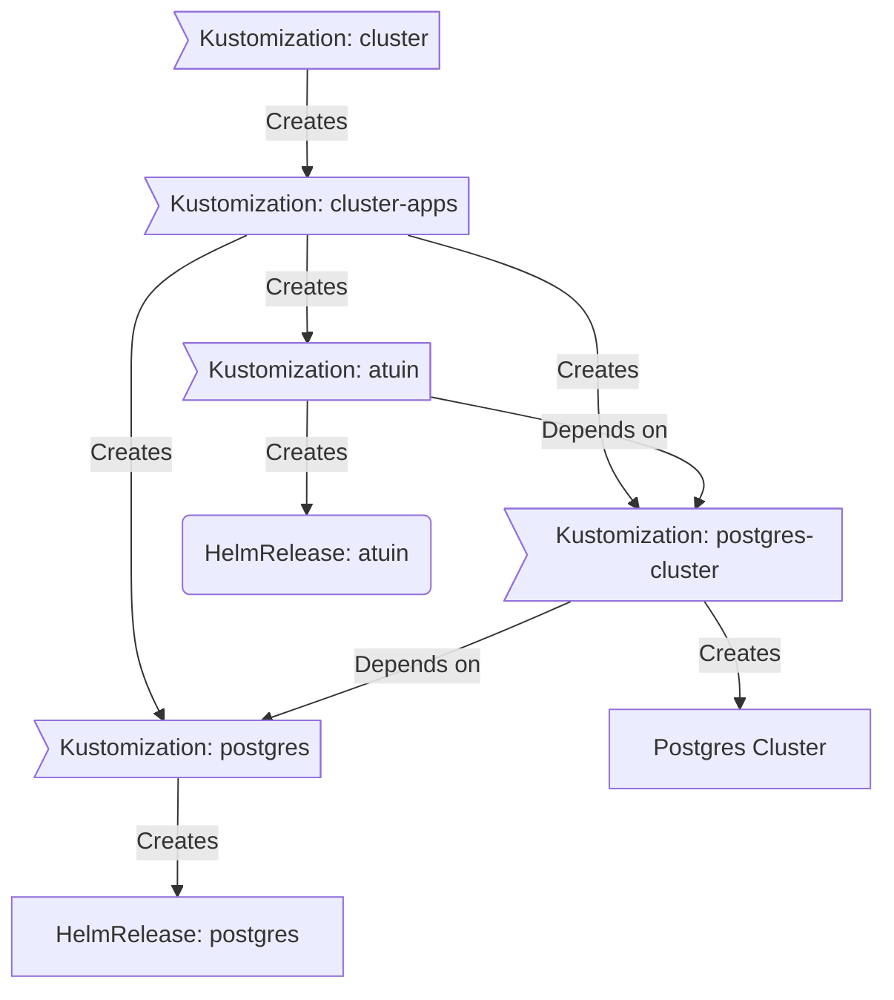

<div align="center">


### My Home Operations Repository :octocat:

_... managed with Flux, Renovate, and GitHub Actions_ 🤖

</div>

<div align="center">

[](https://talos.dev)&nbsp;&nbsp;
[](https://kubernetes.io)&nbsp;&nbsp;
[](https://github.com/nea0d/homelab-ops/actions/workflows/renovate.yaml)

</div>

<div align="center">

[](https://github.com/kashalls/kromgo)&nbsp;&nbsp;
[](https://github.com/kashalls/kromgo)&nbsp;&nbsp;
[](https://github.com/kashalls/kromgo)&nbsp;&nbsp;
[](https://github.com/kashalls/kromgo)&nbsp;&nbsp;
[](https://github.com/kashalls/kromgo)&nbsp;&nbsp;
[](https://github.com/kashalls/kromgo)

</div>

---

## 📖 Overview

This is a mono repository for my home infrastructure and Kubernetes cluster. I try to adhere to Infrastructure as Code (IaC) and GitOps practices using tools like [Ansible](https://www.ansible.com/), [Terraform](https://www.terraform.io/), [Kubernetes](https://kubernetes.io/), [Flux](https://github.com/fluxcd/flux2), [Renovate](https://github.com/renovatebot/renovate), and [GitHub Actions](https://github.com/features/actions).

---

## ⛵ Kubernetes

There is a template over at [onedr0p/flux-cluster-template](https://github.com/onedr0p/flux-cluster-template) if you want to try and follow along with some of the practices I use here.

### ⚙️ Installation

My cluster is [talos](https://talos.dev/) overtop VMs provisioned in a 2-nodes PromoxVE 8 cluster. This is a semi-hyper-converged cluster, workloads and block storage are sharing the same available resources on my nodes while I have a separate server for (NFS) file storage.

### 🔧 Core Components

- [actions-runner-controller](https://github.com/actions/actions-runner-controller): self-hosted Github runners
- [cert-manager](https://cert-manager.io/docs/): creates SSL certificates for services in my cluster
- [cilium](https://github.com/cilium/cilium): internal Kubernetes networking plugin
- [cloudflared](https://github.com/cloudflare/cloudflared): Enables Cloudflare secure access to certain ingresses.
- [external-dns](https://github.com/kubernetes-sigs/external-dns): automatically syncs DNS records from my cluster ingresses to a DNS provider
- [external-secrets](https://github.com/external-secrets/external-secrets): Managed Kubernetes secrets using [Bitwarden Secrets Manager](https://bitwarden.com/products/secrets-manager/).
- [ingress-nginx](https://github.com/kubernetes/ingress-nginx/): ingress controller for Kubernetes using NGINX as a reverse proxy and load balancer
- [rook](https://github.com/rook/rook): distributed block storage for persistent storage
- [sops](https://toolkit.fluxcd.io/guides/mozilla-sops/): managed secrets for Kubernetes, Ansible, and Terraform which are committed to Git
- [spegel](https://github.com/spegel-org/spegel): Stateless cluster local OCI registry mirror.
- [volsync](https://github.com/backube/volsync) and [snapscheduler](https://github.com/backube/snapscheduler): backup and recovery of persistent volume claims

### 🤖 GitOps

[Flux](https://github.com/fluxcd/flux2) watches the clusters in my [kubernetes](./kubernetes/) folder (see Directories below) and makes the changes to my cluster based on the state of my Git repository.

The way Flux works for me here is it will recursively search the `kubernetes/${cluster}/apps` folder until it finds the most top level `kustomization.yaml` per directory and then apply all the resources listed in it. That aforementioned `kustomization.yaml` will generally only have a namespace resource and one or many Flux kustomizations. Those Flux kustomizations will generally have a `HelmRelease` or other resources related to the application underneath it which will be applied.

[Renovate](https://github.com/renovatebot/renovate) watches my **entire** repository looking for dependency updates, when they are found a PR is automatically created. When some PRs are merged [Flux](https://github.com/fluxcd/flux2) applies the changes to my cluster.


### Directories

This Git repository contains the following directories under [Kubernetes](./kubernetes/).

```sh
📁 kubernetes
├── 📁 main            # main cluster
│   ├── 📁 apps           # applications
│   ├── 📁 bootstrap      # bootstrap procedures
│   ├── 📁 flux           # core flux configuration
│   └── 📁 templates      # re-useable components
└── 📁 ...             # other clusters
```

### Flux Workflow

This is a high-level look how Flux deploys my applications with dependencies. Below there are 3 Flux kustomizations `postgres`, `postgres-cluster`, and `atuin`. `postgres` is the first app that needs to be running and healthy before `postgres-cluster` and once `postgres-cluster` is healthy `atuin` will be deployed.



---

## 🌐 DNS

In my cluster there are two [ExternalDNS](https://github.com/kubernetes-sigs/external-dns) instances deployed. One is deployed with the [ExternalDNS webhook provider for UniFi](https://github.com/kashalls/external-dns-unifi-webhook) which syncs DNS records to my UniFi router. The other ExternalDNS instance syncs DNS records to Cloudflare only when the ingresses and services have an ingress class name of `external` and contain an ingress annotation `external-dns.alpha.kubernetes.io/target`. All local clients on my network use my UniFi router as the upstream DNS server.

---

## 🤝 Gratitude and Thanks

Thanks to all the people who donate their time to the [Home Operations](https://discord.gg/home-operations) Discord community. A lot of inspiration for my cluster comes from the people who have shared their clusters using the [kubesearch](https://github.com/topics/kubesearch) GitHub topic. Be sure to check out [kubesearch.dev](https://kubesearch.dev/) for ideas on how to deploy applications or get ideas on what you can deploy.

---

## 📜 Changelog

See [commit history](https://github.com/nea0d/homelab-ops/commits/main)
